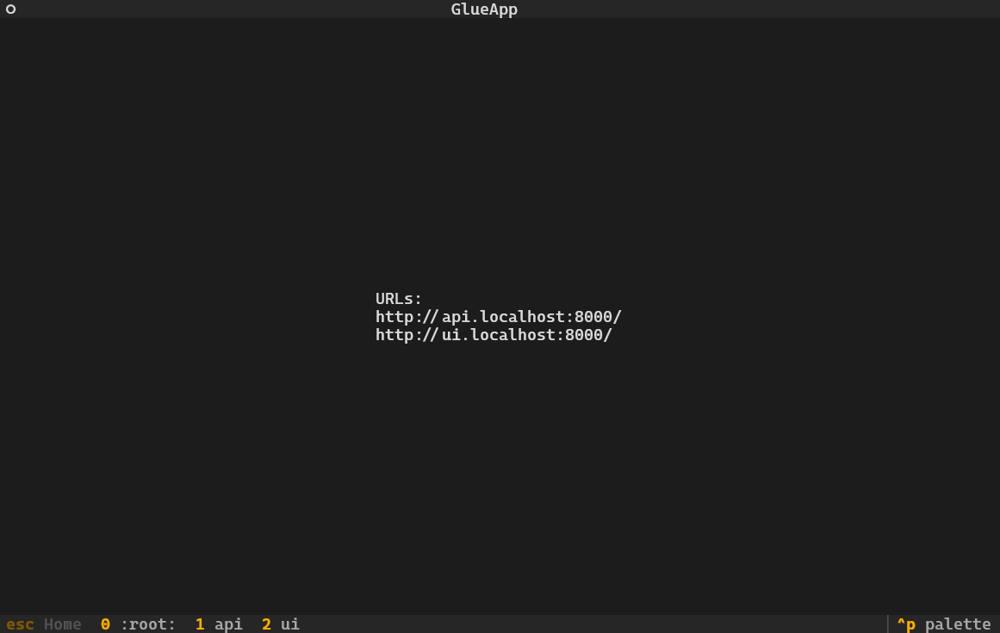

# Glue

Glue is a tool to assist with local development of multiple web services. It is an
infrastructure orchestrator and can be compared to docker-compose in purpose.

> **Note**: Only Unix systems are supported for now. This project takes advantage of the
  [`pty`][pty] module, which is not available on Windows systems.



[pty]: https://docs.python.org/3/library/pty.html

## Installation

Glue is meant to be installed in its own isolated python environment. It's recommended to
install with `pipx`.

Glue is not yet available on pypi. You can install the development version via:

```sh
pipx install git+https://github.com/killjoy1221/glue.git
```

## Configuration

Glue can be configured via toml format. See the [example config](example/servers.toml).

## Usage

To start, run the `glue` command with the config path as the first argument. This will
start all your servers in the background.

To view your server logs, click one of the buttons in the footer or press its
corresponding keybind.

If you need to manually restart one of your services, press `ctrl+r` while its log screen
is active.

To shutdown all services and exit the application, simply press `ctrl+c`.
